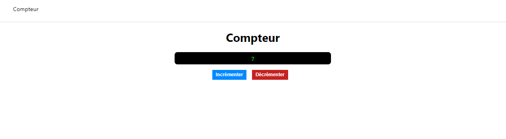

# TDD avec React / Jest / Enzyme

## Aperçu de l'application 

## Ordre de construction des composants

1. Header
2. Counter

Le fond a été implémenté avant la mise en forme (le fonctionnel prime sur le visuel).

## Commandes

npm run start : Démarrer l'application

npm run test : Démarrer les tests unitaires
